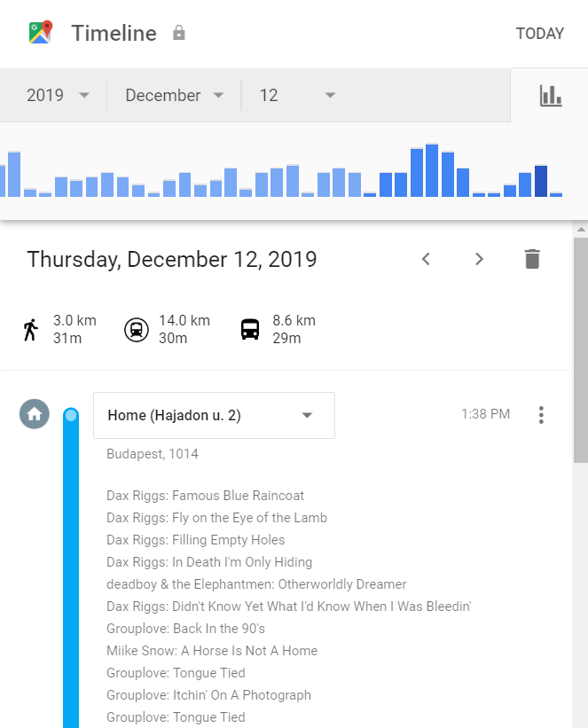

This is a Google Chrome extension that displays your [Last.fm](https://www.last.fm/) scrobbles on your [Google Maps Timeline](https://www.google.com/maps/timeline). It lets you see where you listened to songs.

This is very much a work in progress. See the [TODO](./TODO.md) document for a vague roadmap.

# Installation

Manually, as an [unpacked extension](https://developer.chrome.com/extensions/getstarted).

# How it works

It analyzes the DOM of the timeline page, parsing time information. It then queries last.fm for the songs scrobbled during the day, and injects data about the song to under the appropriate activity.

Of course it is extremely fragile, and will break horribly if the structure of the Timeline page changes.
